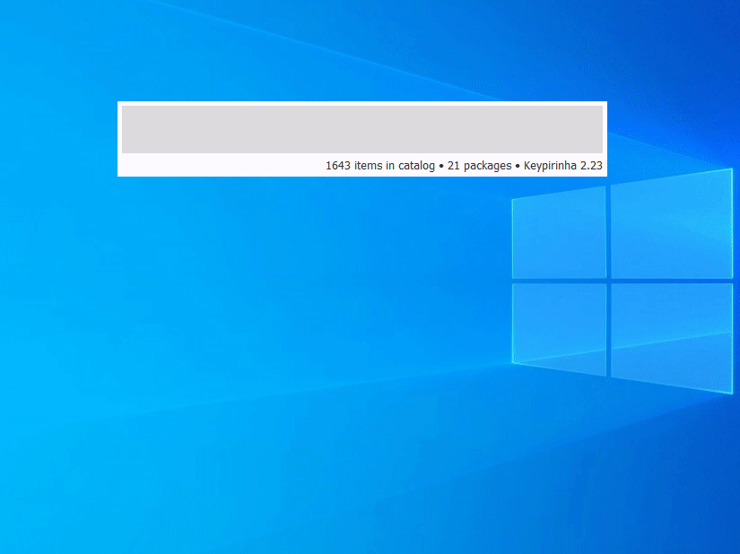
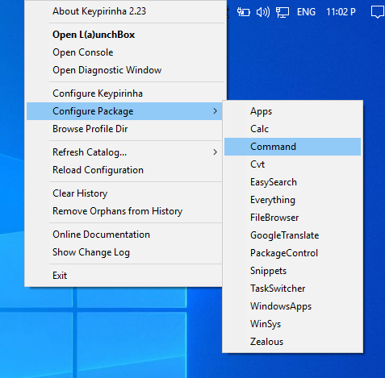
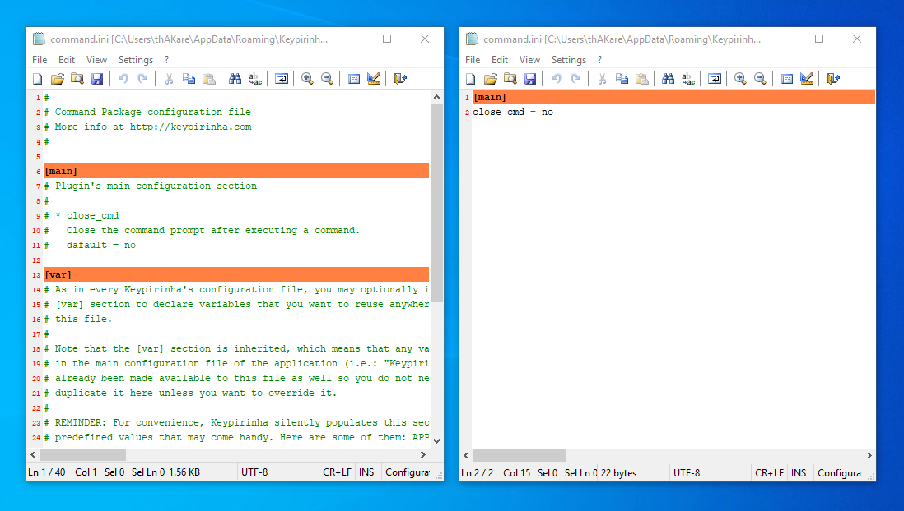
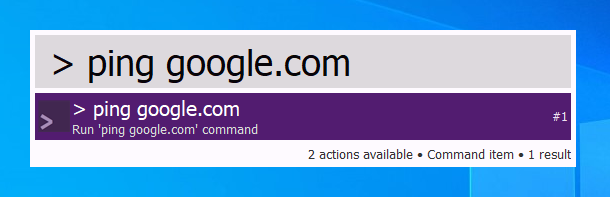
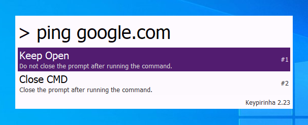

# Keypirinha Plugin: Command

This is Command, a plugin for the
[Keypirinha](http://keypirinha.com) launcher.

This package provides an easy way to execute simple commands from launcher.



## Install

There are two ways to install:

1. Using **PackageControl**:

    - Invoke Keypirinha and type `install package`.
    - Click enter.
    - Now search for package `Command`.
    - Again press enter.

    About [PackageContol](https://github.com/ueffel/Keypirinha-PackageControl).

2. Manual:

    Download the plugin file from [here](https://github.com/bantya/Keypirinha-Command/releases).

    Once the `Command.keypirinha-package` file is downloaded,
    move it to the `InstalledPackage` folder located at:

    * `Keypirinha\portable\Profile\InstalledPackages` in **Portable mode**
    * **Or** `%APPDATA%\Keypirinha\InstalledPackages` in **Installed mode** (the
    final path would look like
    `C:\Users\%USERNAME%\AppData\Roaming\Keypirinha\InstalledPackages`)

**NOTE:** You may have to manually restart Keypirinha to see the package activated.
    

    

## Configuration
0. There is no configuration required. If you want, you can proceed to **Step 1**.

1. Open the `Command` config file.



2. Set `close_cmd`.



The possible values are:

- `yes`: Close the command prompt after executing the command. 
- `no`: Keep the command prompt open. (Default)

## Usage



Invoke Keypirinha and put the command to be executed in following format:
```
> [command (can contain spaces)]


e.g.

> ping google.com -> This will open the command prompt and ping google.com
```

### Actions

There are two actions available irrespective of the configuration.



- **Keep Open**: Do not close the prompt after running the command. 
- **Close CMD**: Close the prompt after running the command.

## Change Log

### v1.0

* Initial release.
* Added actions.


## License

MIT, that's it.


## Credits

*Waiting for the first name to appear here.*


## Contribute
Here is how to contribute:
1. Check for open issues or open a fresh issue to start a discussion around a
   feature idea or a bug.
2. Fork this repository on GitHub to start making your changes to the **dev**
   branch.
3. Send a pull request.
4. Add yourself to the *Contributors* section below (or create it if needed)!


## Anything else?
No, Thanks to all.
